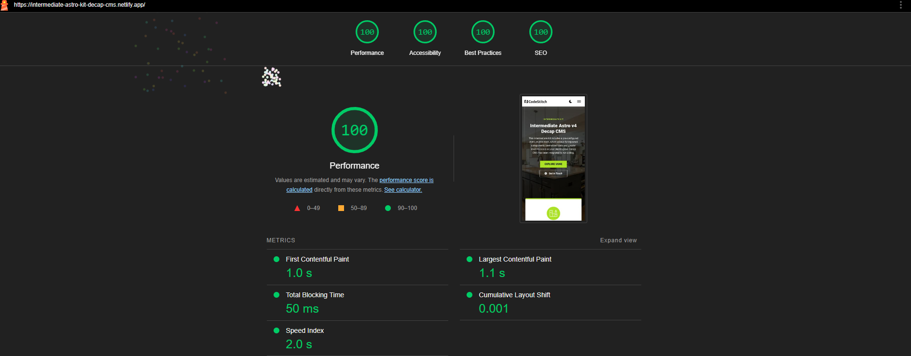

# Sydney deCastro LMT - Professional Massage Therapy Website

A modern, responsive website built with Astro v5 and integrated with CloudCannon CMS for easy content management.



## Live Site

[View Live Site](http://sydneydecastrolmt.netlify.app)

## Overview

This single-page website showcases multiple sections with booking link, contact forms, and content management. The site features dynamic content editing through CloudCannon's visual editor, allowing non-technical content updates.

## Technical Stack

- **Framework**: Astro v5 with View Transitions
- **CMS**: CloudCannon with `@cloudcannon/editable-regions` for visual editing
- **Styling**: LESS CSS preprocessor
- **Components**: CodeStitch component library (customized)
- **Forms**: Netlify Forms with honeypot spam protection and reCAPTCHA-ready configuration
- **Deployment**: Netlify with automatic builds
- **Image Optimization**: Automatic AVIF/WebP conversion via Astro's image pipeline

## Key Custom Features

- **Content Collections** - Type-safe content management with Zod schema validation for CloudCannon-managed pages
- **Component Architecture** - Reusable Astro components with scoped LESS styling
- **Scroll Animations** - Custom Intersection Observer implementation for fade-in effects on scroll
- **Dynamic Routing** - Catch-all route pattern (`[...slug].astro`) for content-driven pages

## Built From

This project was built from the [Intermediate Astro Kit](https://github.com/CodeStitchOfficial/Intermediate-Astro-Decap-CMS) by CodeStitch, with extensive customization including:

- Complete CMS replacement (Decap → CloudCannon)
- Custom color scheme and branding
- Professional photography integration
- Location-specific content (Inspire Wellness Studio)
- Custom page sections and animations
- Netlify Forms implementation
- Custom content schema for CloudCannon

## Project Structure

```
├── src/
│   ├── pages/
│   │   ├── [...slug].astro      # Dynamic page renderer
│   │   ├── contact.astro         # Contact form page
│   │   └── blog/                 # Blog routes
│   ├── components/               # Reusable Astro components
│   ├── layouts/                  # Page templates
│   ├── content/
│   │   ├── pages/                # CloudCannon-managed content
│   │   └── blog/                 # Blog posts
│   ├── styles/                   # Global LESS styles
│   └── data/                     # Site configuration
├── public/
│   └── assets/                   # Static assets
└── cloudcannon.config.yml        # CloudCannon configuration
```

## Local Development

1. Clone the repository
```bash
git clone [repository-url]
cd syd-decastro
```

2. Install dependencies
```bash
npm install
```

3. Start development server
```bash
npm run dev
```

4. Build for production
```bash
npm run build
```

## Content Management

Content is managed through CloudCannon's visual editor, allowing easy updates to:
- Hero section (title, description, buttons, location)
- About section content
- Commitment section content
- Massage modalities and descriptions
- Blog posts

## Configuration

Key configuration files:
- `cloudcannon.config.yml` - CloudCannon CMS settings
- `src/data/client.json` - Business information and contact details
- `src/data/navData.json` - Navigation structure
- `astro.config.mjs` - Astro configuration with sitemap and form detection

## Deployment

The site is deployed on Netlify with:
- Automatic builds on git push
- Form detection enabled
- CloudCannon integration for content updates
- Custom domain support

## Credits

- **Developer**: Nakamura Web Services
- **Base Template**: [Intermediate Astro Kit](https://github.com/CodeStitchOfficial/Intermediate-Astro-Decap-CMS) by CodeStitch
- **Components**: [CodeStitch](https://codestitch.app/)
- **CMS**: [CloudCannon](https://cloudcannon.com/)

## License

Built for Sydney deCastro LMT, 2024-2025.
